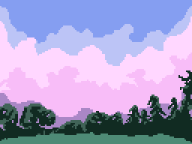

# Graphics!

Some graphics/photos I've made/edited!

## Software I'm Using

- [aseprite](https://www.aseprite.org)
    - amazing pixel art software!
    - one of the greatest tools of all time! :goat:
    - I compiled from source from their [repo](https://github.com/aseprite/aseprite) (sorry aseprite devs, I'm poor :grin:)
        - the build process is kinda tedious btw, but skia is pretty cool
- [affinity](https://affinity.serif.com)
    - much cheaper than the blisteringly expensive Adobe Creative Cloud 
    - designer: vector graphics
    - photo: photo editing

I'm using GitHub to transfer the files easily from my laptop to my desktop, and also everything is "backed up" that way.

## Latest Example

> park in pixel art!

## Dev Notes

- git will ignore everything in `exports/` and `ignore/` directories, including those named that in the subdirectories
- licensing stuff is kinda fun!
- using git lfs for tracking these files (.afdesign, .afphoto, .afpub, .aseprite)

